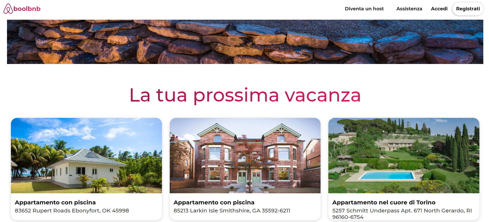
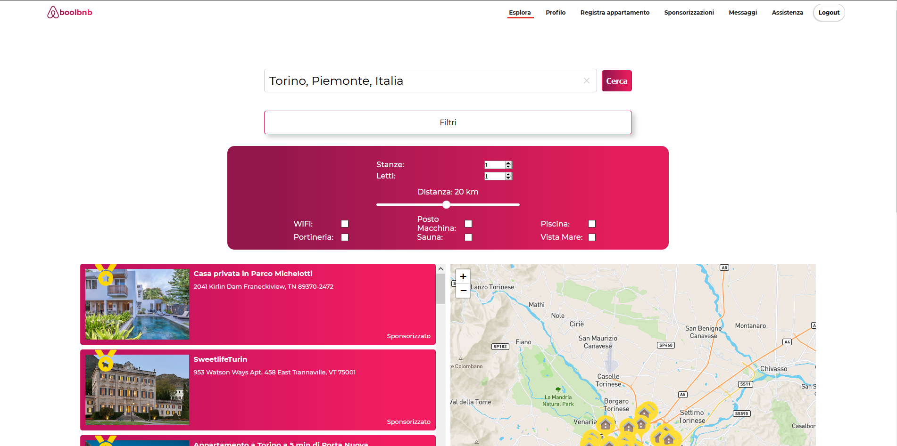
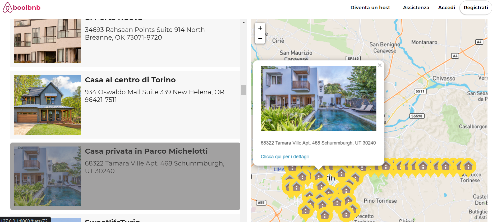
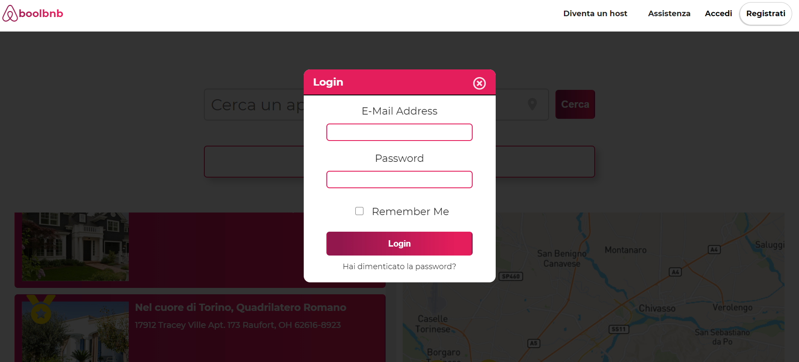
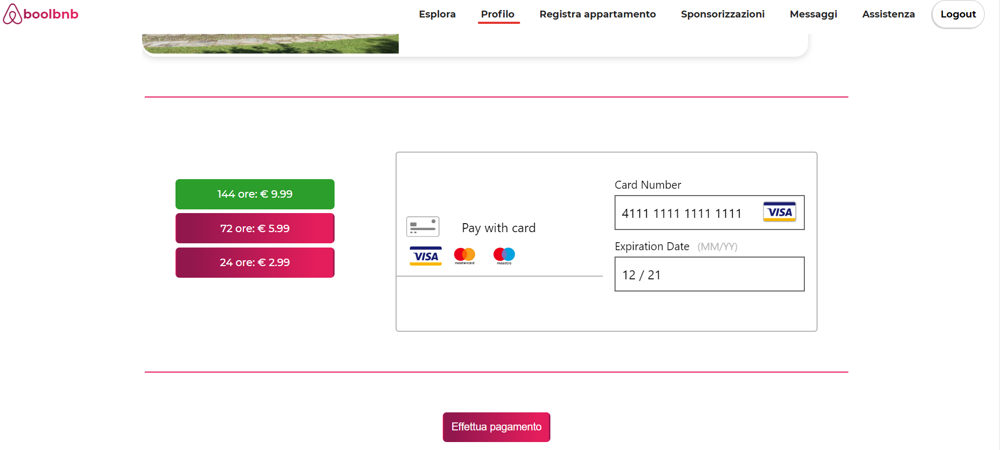
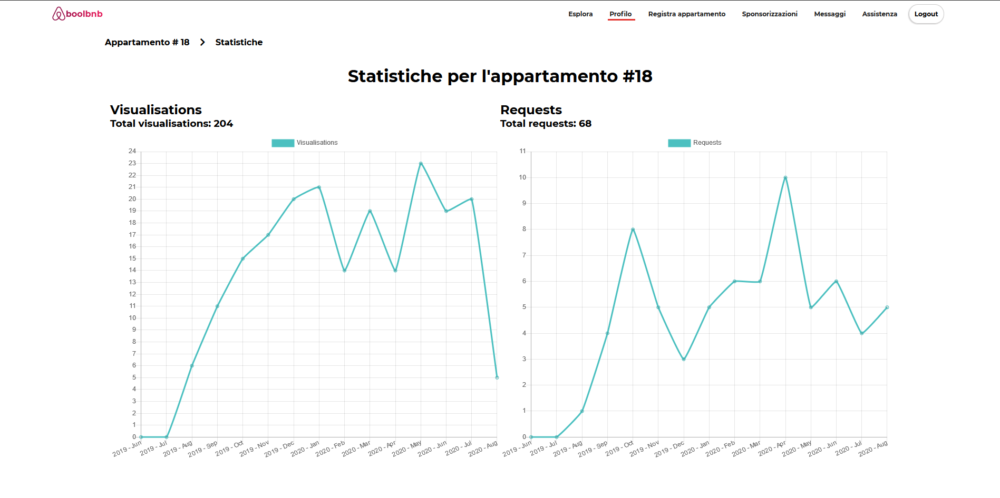

# BoolBnB

BoolBnB è una applicazione per trovare e gestire l’affitto di appartamenti. Attraverso BoolBnB i proprietari di appartamento possono inserire le informazioni degli appartamenti che vogliono affittare per cercare utenti interessati. 
 
Gli utenti che vogliono mettere in affitto un appartamento devono registrarsi alla piattaforma; una volta registrati hanno la possibilità di inserire uno o più appartamenti. 
 
Gli utenti interessati ad un appartamento, utilizzando i filtri di una apposita pagina di ricerca, vedono una lista di possibili appartamenti e cliccando su ognuno possono vedere una pagina di dettaglio. Una volta trovato l’appartamento desiderato, l’utente interessato può contattare l’utente proprietario per fare domande. 
 
Inoltre, i proprietari di un appartamento possono decidere di pagare per sponsorizzare l’annuncio del proprio appartamento per fare in modo che il loro annuncio sia maggiormente in evidenza rispetto a quelli non sponsorizzati.

## Requisiti minimi
BoolBnB è basato sul framework Php **Laravel**. 

Composer 1.10.7  
PHP 7.2.5  
MySQL 10.4.11   
Node.js 13.12.0  

Inoltre, è necessario avere un Sandbox account **[Braintree](https://www.braintreepayments.com/)**, e un account **[Algolia](https://www.algolia.com/)**.

## Uso
Installa dapprima i moduli necessari:

```
composer install
```

```
npm install
```

Crea il file .env, seguendo l'esempio fornito da .env.example (si trova nella cartella root). Di particolare importanza i seguenti parametri in riferimento al database (MySql), all'account Braintree, e all'account Algolia:

```
DB_HOST
DB_PORT
DB_DATABASE
DB_USERNAME
DB_PASSWORD

BT_MERCHANT_ID
BT_PUBLIC_KEY
BT_PRIVATE_KEY

PLACES_APP_ID
PLACES_API_KEY
ALGOLIA_APP_ID
ALGOLIA_SECRET
```

Lancia i seguenti comandi:
```
php artisan key:generate 
 ```

```
php artisan serve
 ```

```
npm run watch
 ```


Esegui le migrazioni e il seeding:

 ```
php artisan migrate:fresh --seed
 ```

# Anteprima
## Homepage



## Ricerca dell'appartamento



## Mappa interattiva con i risultati della ricerca



## Popup per loggarsi



## L'utente registrato può consultare i messaggi ricevuti


## L'utente registrato può sponsorizzare il suo appartamento



## L'utente può prendere visione delle statistiche degli appartamenti da lui pubblicati

