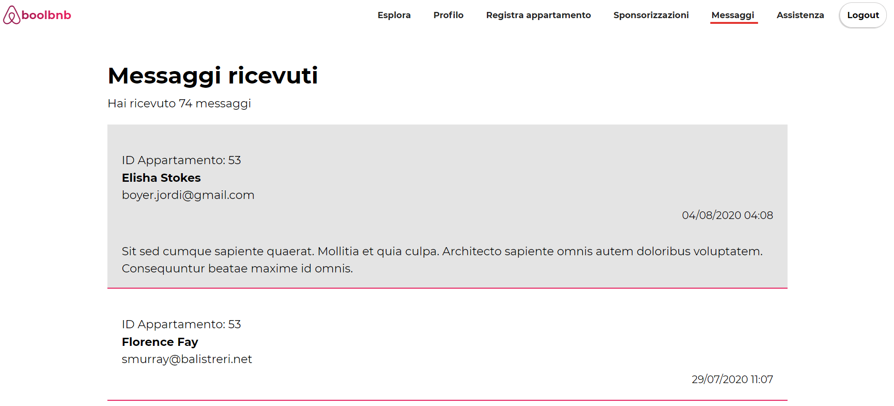

# BoolBnB

**BoolBnB** is an application which provides an online vacation online marketplace. 

Upon registration into the platform, flat owners and managers may enter one or many flats they want to rent.

Common users may search for a flat in the search page, and then view the detail page of the flat they are interested in. Once the desired apartment has been found, the interested user can send a message to the owner through the app.

Furthermore, owners may require their apartment to be listed more prominently in the search results by paying a fee.

## Minimum requirements 
BoolBnB is  built on the PHP framework Laravel **Laravel**. 

Composer 1.10.7  
PHP 7.2.5  
MySQL 10.4.11   
Node.js 13.12.0  

The following are also required: **[Braintree](https://www.braintreepayments.com/)** Sandbox account; **[Algolia](https://www.algolia.com/)** account.


## Uso
Download the repository, then install the required packages:

```
composer install
```

```
npm install
```

Create a .env fil, following the example .env.example (in root folder). The following variable are most important: database variables (MySql), Braintree account keys, and Algolia account keys:

```
DB_HOST
DB_PORT
DB_DATABASE
DB_USERNAME
DB_PASSWORD

BT_MERCHANT_ID
BT_PUBLIC_KEY
BT_PRIVATE_KEY

PLACES_APP_ID
PLACES_API_KEY
ALGOLIA_APP_ID
ALGOLIA_SECRET
```

Then do:
```
php artisan key:generate 
 ```

```
php artisan serve
 ```

```
npm run watch
```


Migrate and seed:

```
php artisan migrate:fresh --seed
```

# Preview
## Homepage


## Searching a flat


## Interactive map with search results:  


## Log in into the app


## Logged user can read received messages



## Logged user may his apartment to be listed  more prominently in the search results by paying a fee.


## Logged user may consult statistics on the flats he has entered into the platform. 


